# Panduan Pengguna Transniaga

Transniaga adalah direktori dan marketplace UMKM Kawasan Transmigrasi Prafi, Manokwari. Panduan ini menjelaskan cara
memakai Transniaga untuk **pengunjung**, **penjual (UMKM)**, dan **administrator**. Versi interaktif tersedia di
halaman `/panduan`.

---

## 1. Pengunjung

- **Beranda**: carousel menampilkan gambar setiap **kategori produk**; di sebelahnya tampil produk dari kategori yang sedang tampil (berganti mengikuti carousel, rating tertinggi lebih dulu). Klik gambar atau **Lihat semua** untuk membuka semua produk kategori itu. Di bawahnya ada produk rekomendasi lainnya.
- Produk berlabel **rekomendasi** (ikon jempol) adalah produk dengan rata-rata ulasan **4,8 bintang atau lebih**.
- Klik ikon **kaca pembesar** di kanan atas untuk mencari produk atau toko. Tekan *Enter* untuk melihat semua hasil.

  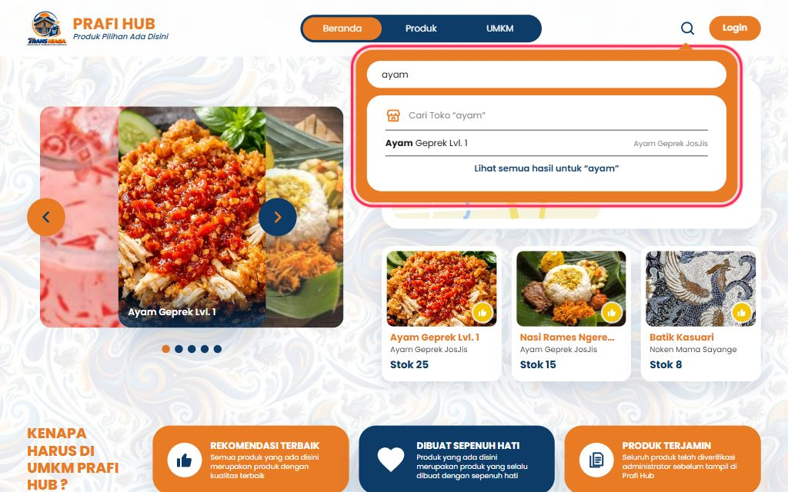

- Menu **Produk** menampilkan semua produk; menu **UMKM** menampilkan daftar toko beserta produknya.
- Klik produk untuk melihat detail: harga, deskripsi, informasi produk, ulasan pembeli, dan toko penjualnya. Siapa pun dapat memberi bintang dan ulasan tanpa login.
- Di halaman produk, tombol **Hubungi & Kunjungi Toko** (WhatsApp, Shopee, Instagram, Google Bisnis, Facebook, Lokasi) hanya muncul untuk tautan yang diisi penjual. Tombol **WhatsApp** membuka chat dengan pesan siap kirim: *"Halo kak saya ingin menanyakan tentang produk <nama produk> apakah masih ada? <tautan produk>"*.
- Klik nama toko atau **Lihat UMKM** untuk membuka halaman UMKM: profil, alamat, jam buka, tombol WhatsApp/Instagram/Shopee/Google Bisnis, jumlah produk, rata-rata bintang, dan semua produknya. Tombol WhatsApp di sini membuka chat dengan pesan *"Hi kak, saya mau bertanya tentang produk di toko <nama toko>"*.

  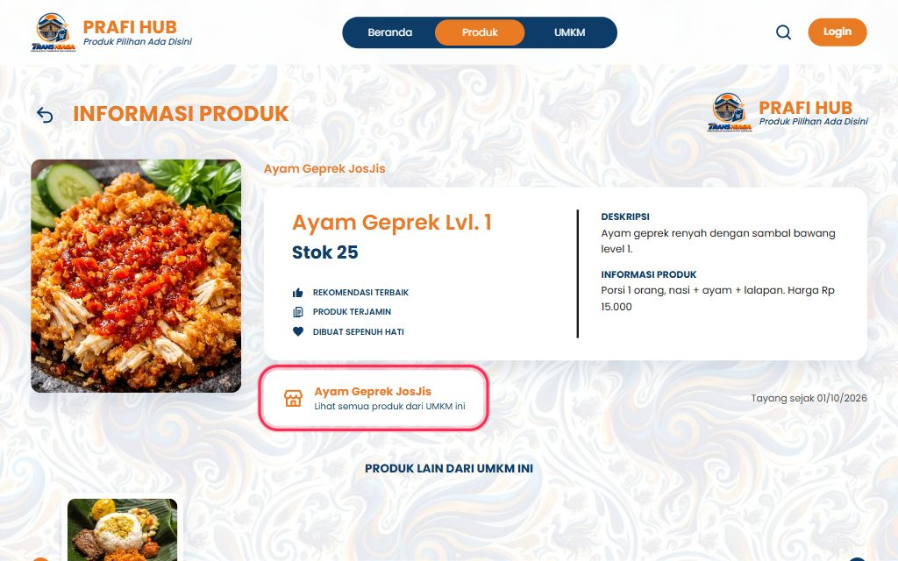

---

## 2. Penjual (UMKM)

### 2.1 Mendaftar

1. Klik **Login** → **DAFTAR**, atau buka `/register`.

   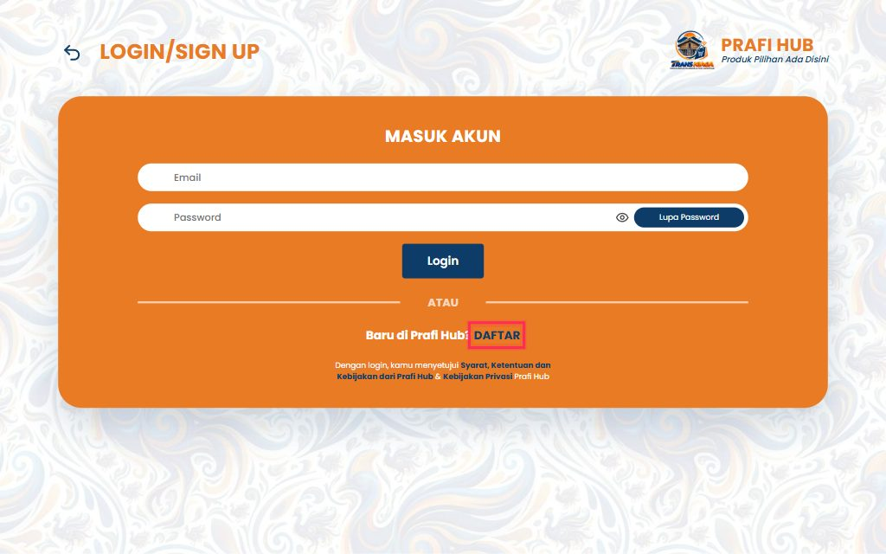

2. **Tahap 1 – Informasi Akun:** isi nama lengkap, nomor telepon/WhatsApp, email aktif, password (min. 8 karakter)
   beserta konfirmasinya, dan **nama usaha/toko**. Klik **SELANJUTNYA**.

   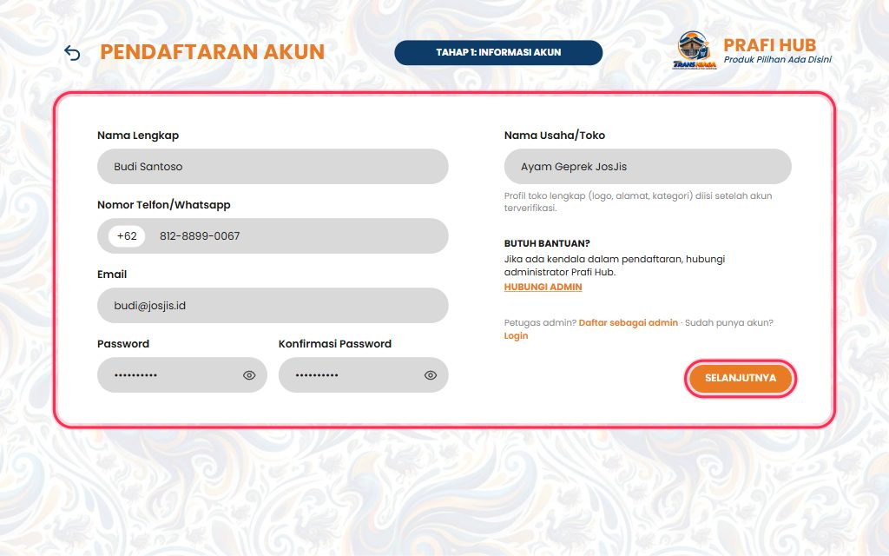

3. **Tahap 2 – Review Data:** periksa data. Klik **EDIT DATA** untuk memperbaiki, lalu **KIRIM PENDAFTARAN**.

   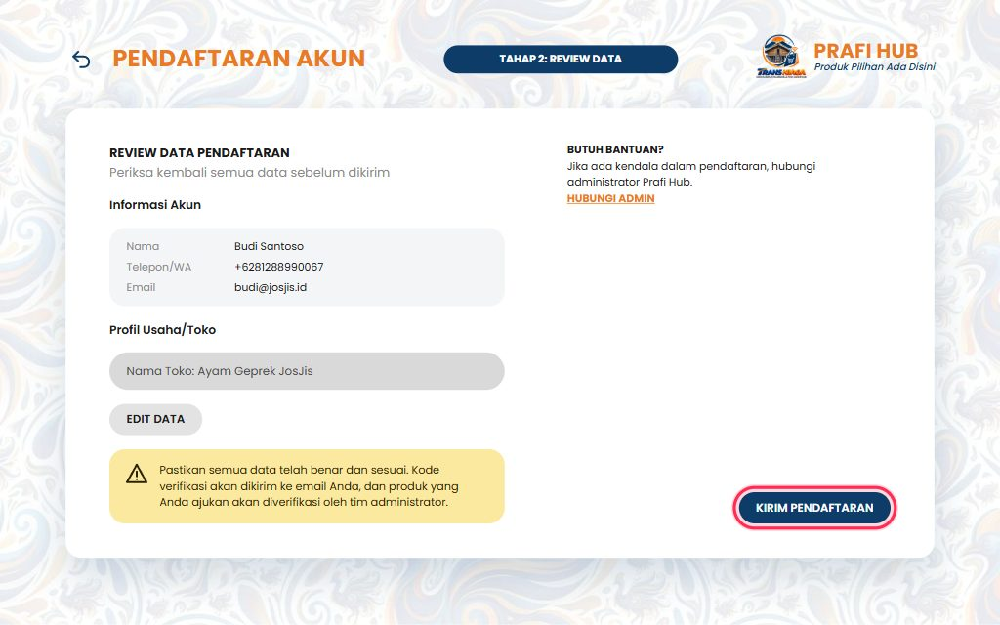

4. **Tahap 3 – Verifikasi Email:** masukkan **kode OTP 6 digit** dari email (berlaku 15 menit, maksimal 5 kali salah).
   Klik **Kirim ulang kode** bila perlu (tersedia setiap 60 detik).

   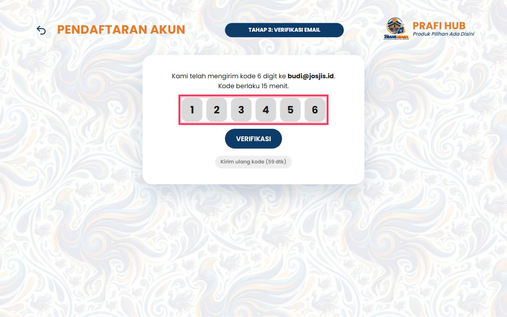

5. **Tahap 4 – Selesai:** Anda langsung masuk. Lanjutkan dengan **LENGKAPI PROFIL TOKO**.

   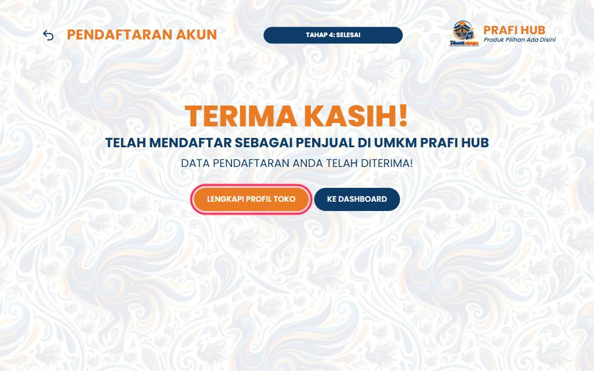

> Sudah mendaftar tapi belum verifikasi? Cukup login — Anda akan diarahkan ke halaman verifikasi OTP.

### 2.2 Membuat profil toko (Profil UMKM)

1. Buka menu **Profil UMKM**.

   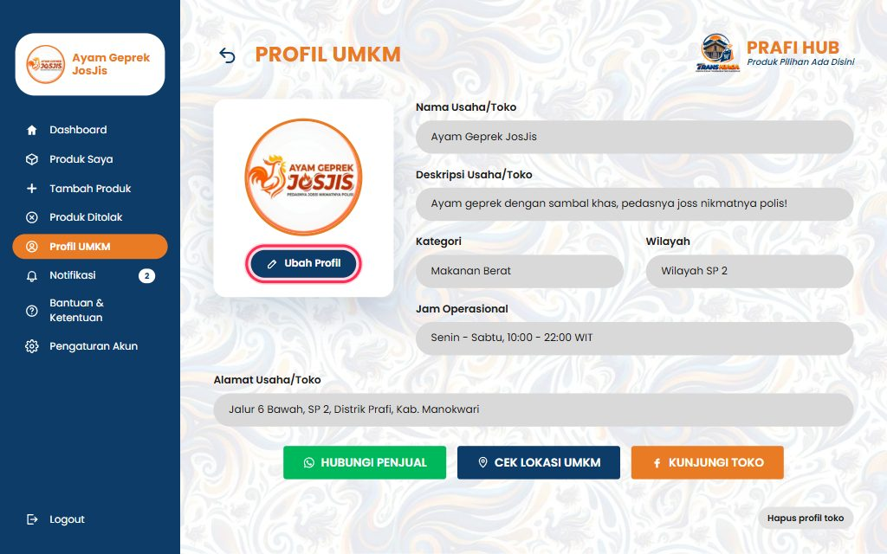

2. Pilih logo/foto toko (JPG, PNG, WEBP, atau GIF, maks. 5 MB). Foto langsung terunggah, tetapi baru tersimpan setelah Anda klik **SIMPAN PROFIL**.
3. Isi nama toko, **wilayah** (SP 1 – SP 4 atau *Lainnya*), deskripsi, dan alamat. (Kategori kini dipilih per produk, bukan di profil toko.)
4. Isi jam operasional (hari, jam buka, jam tutup) dan nomor WhatsApp.
5. **Tautan Facebook / Toko Online wajib diisi** (diawali `https://`). Tautan Google Maps, Instagram, Google Bisnis, dan Shopee boleh dikosongkan. Profil tanpa tautan Facebook dianggap belum lengkap, sehingga belum bisa menambah produk.

   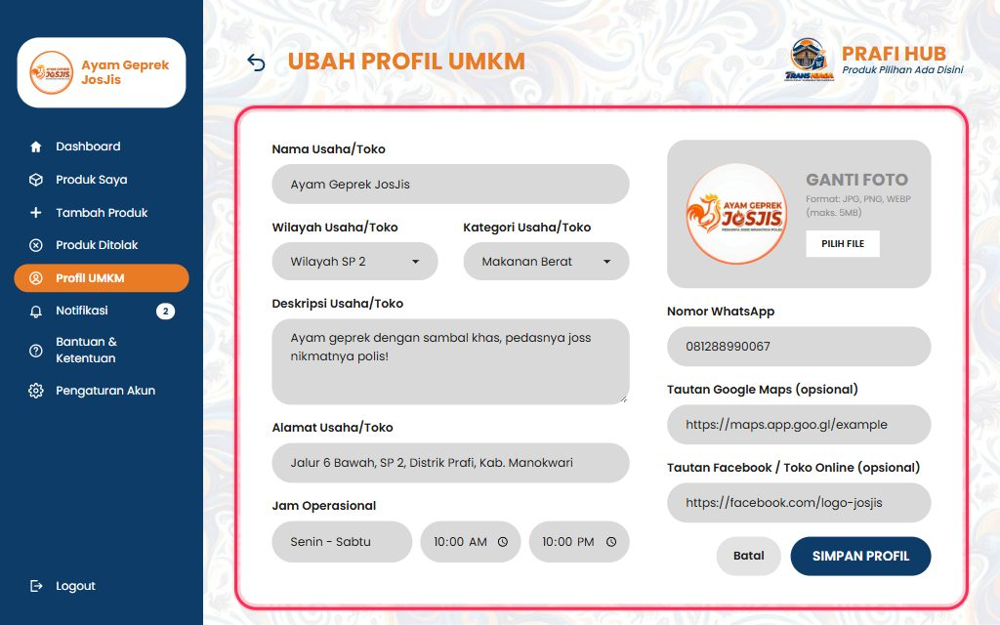

6. Klik **SIMPAN PROFIL**. Ubah kapan saja lewat **Ubah Profil**.

> Agar dapat menambahkan produk, profil harus lengkap **dan** akun Anda harus memiliki **foto profil** (menu *Pengaturan Akun*).

   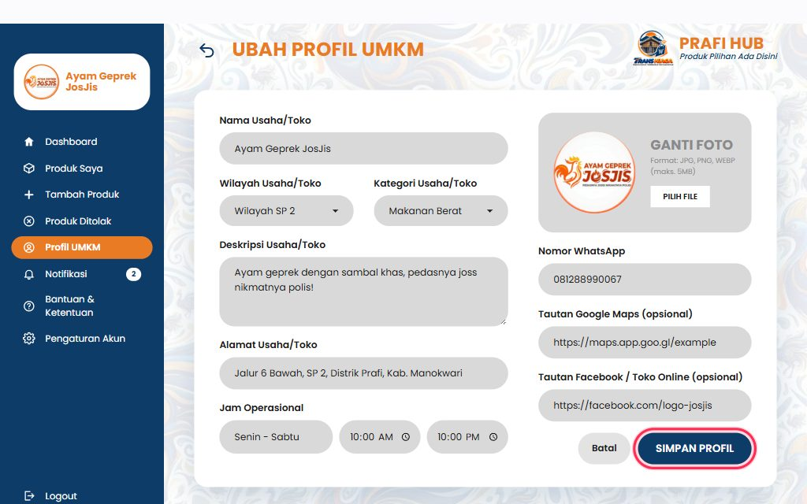

### 2.3 Menambahkan produk

1. Klik menu **Tambah Produk** (atau tombol **+** di *Produk Saya*). Bila muncul pesan *Lengkapi data Anda dulu*, klik tombolnya untuk melengkapi Profil UMKM atau mengunggah foto profil akun.

   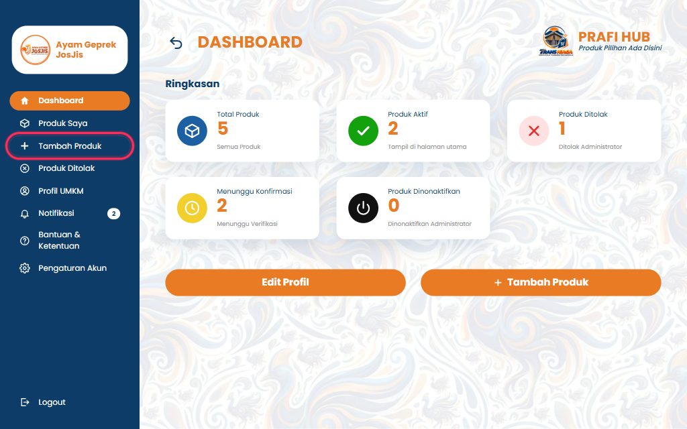

2. Klik **UNGGAH FOTO PRODUK → PILIH FILE**. Foto langsung terunggah (ada tanda persen), tetapi baru tersimpan setelah Anda klik **Ajukan Produk**.

   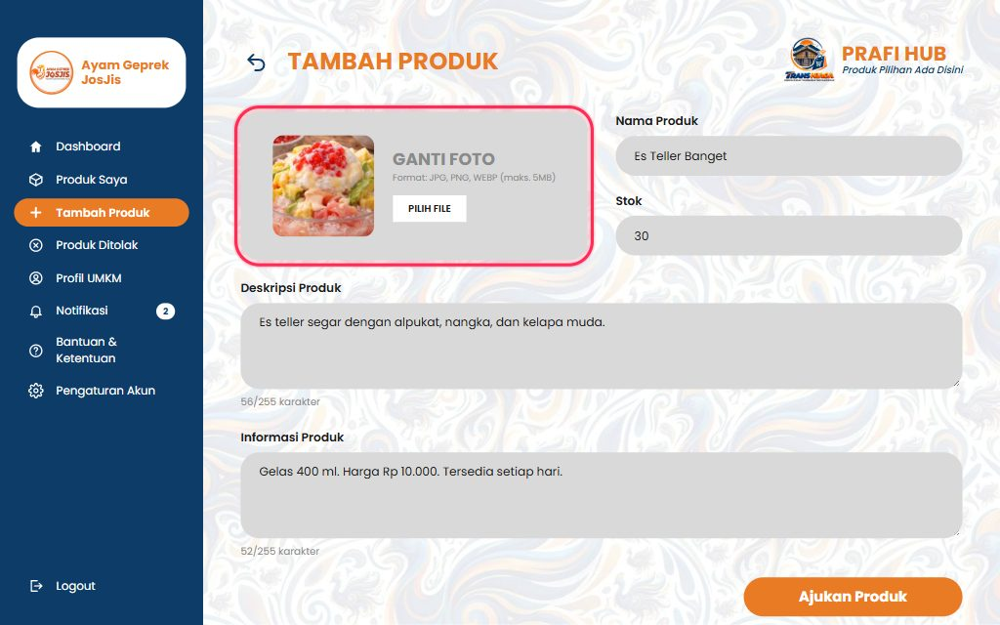

3. Isi **Nama Produk**, **Harga** (Rupiah), dan pilih **Kategori Produk** (dibuat oleh administrator). Label **rekomendasi** diberikan otomatis bila rata-rata ulasan pembeli mencapai **4,8 bintang atau lebih**; penjual tidak lagi mencentangnya sendiri.
4. Isi **Deskripsi Produk** (singkat) dan **Informasi Produk** (bahan, ukuran, harga, cara pakai, keunggulan) —
   masing-masing maksimal 255 karakter.

   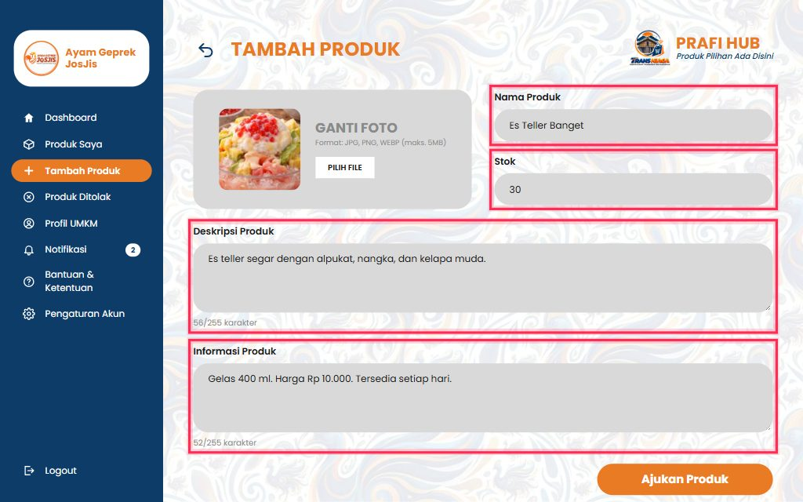

5. Klik **Ajukan Produk**. Status menjadi **Menunggu Konfirmasi** dan Anda mendapat notifikasi
   *Produk Berhasil Diajukan*.

   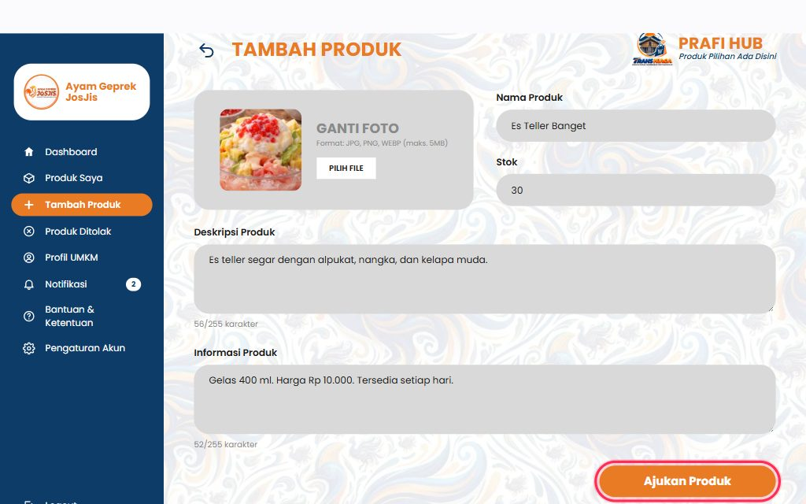

6. Setelah disetujui administrator atau Disnakertrans, status menjadi **Aktif**, produk tampil di beranda, dan Anda
   mendapat notifikasi *Produk Disetujui*.

   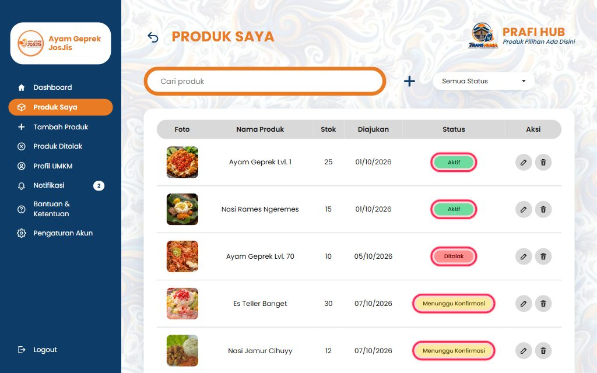

### 2.4 Mengelola produk

- **Produk Saya:** cari produk, saring berdasarkan status, ubah (ikon pensil), atau hapus (ikon tempat sampah).
- **Status produk:**

  | Status | Arti |
  | --- | --- |
  | Menunggu Konfirmasi | sedang diperiksa administrator atau Disnakertrans |
  | Aktif | disetujui dan tampil untuk pengunjung |
  | Ditolak | belum memenuhi ketentuan — lihat alasan di *Produk Ditolak* |
  | Dinonaktifkan | diturunkan administrator atau Disnakertrans |

- **Produk Ditolak:** baca alasan penolakan, klik ikon pensil, perbaiki, lalu klik **Simpan & Ajukan Ulang**.
  Produk kembali berstatus *Menunggu Konfirmasi*.

  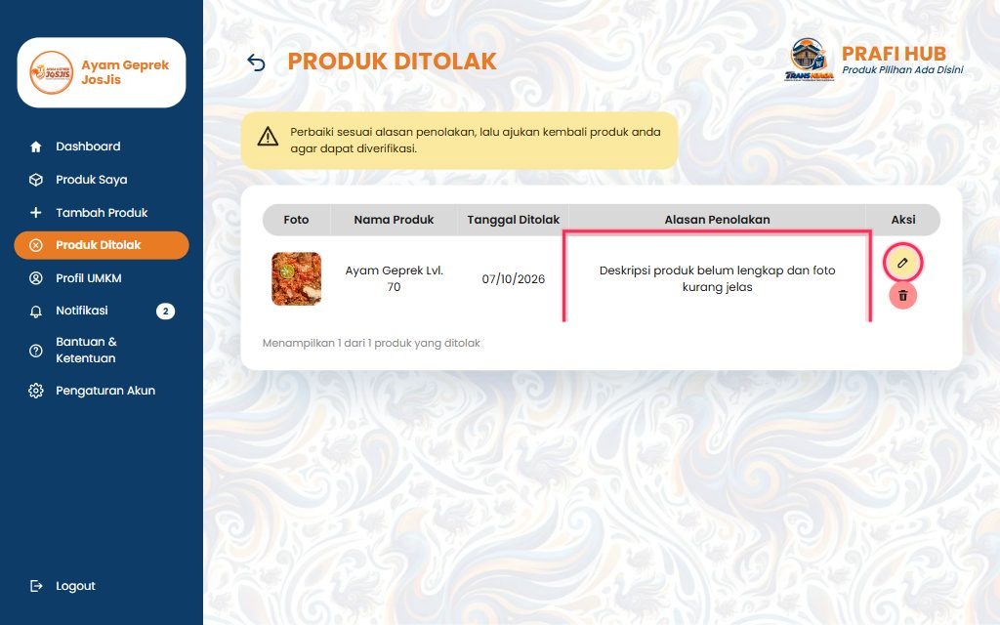

  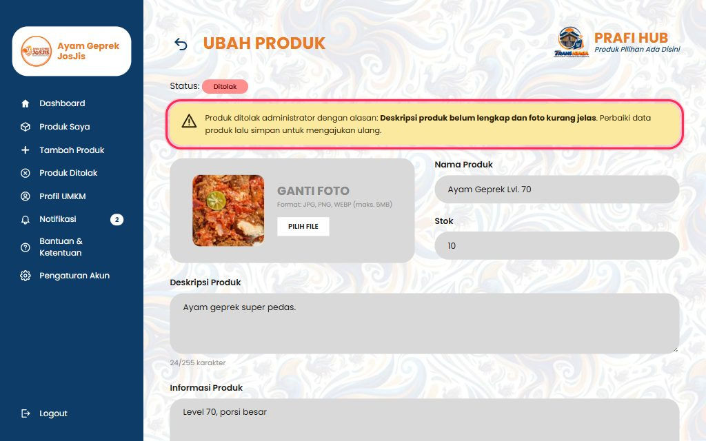

### 2.5 Ketentuan foto & deskripsi

- Foto jelas, terang, tidak buram, dan menampilkan produk yang sebenarnya.
- Tanpa nomor telepon, tautan, atau watermark toko lain. Satu foto hanya untuk satu produk.
- Nama dan deskripsi jujur, tidak menyesatkan, dan tidak melanggar hukum/hak cipta.

### 2.6 Notifikasi

Notifikasi baru langsung muncul tanpa memuat ulang halaman. Menu **Notifikasi** (dengan angka belum dibaca) memiliki tab *Semua*, *Belum Dibaca*, dan *Dibaca*. Klik notifikasi
untuk membuka halaman terkait; klik **Tandai semua sebagai sudah dibaca** untuk membersihkan badge.

Penjual menerima notifikasi untuk setiap perubahan pada produknya:

| Notifikasi | Kapan |
| --- | --- |
| Produk Berhasil Diajukan | Anda menambahkan produk |
| Produk Disetujui | produk disetujui atau diaktifkan kembali |
| Produk Ditolak / Produk Dinonaktifkan | administrator atau Disnakertrans menolak / menurunkan produk, **beserta alasannya** |
| Perubahan Produk Tersimpan | Anda mengubah produk (tetap tayang, atau menunggu konfirmasi ulang) |
| Ulasan Baru | pembeli memberi bintang dan ulasan |

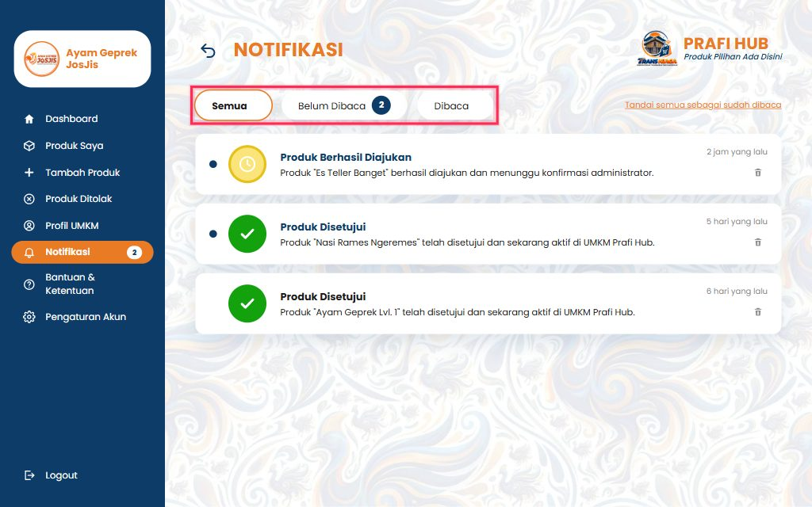

---

## 3. Akun & keamanan (semua pengguna)

- **Pengaturan Akun:** ubah nama, email, nomor telepon, nama toko, dan foto profil → **SIMPAN PERUBAHAN**. Foto baru
  langsung terunggah saat dipilih, tetapi baru terpasang setelah **SIMPAN PERUBAHAN**.
- **Foto belum disimpan?** Jika Anda meninggalkan halaman sebelum menyimpan, muncul konfirmasi *Tinggalkan halaman ini?*:
  **Lanjut Suntingan** untuk kembali menyunting, atau **Setuju** untuk keluar (foto dihapus, tidak ada data yang berubah).
- **Ubah Password:** masukkan password saat ini dan password baru (min. 8 karakter).

  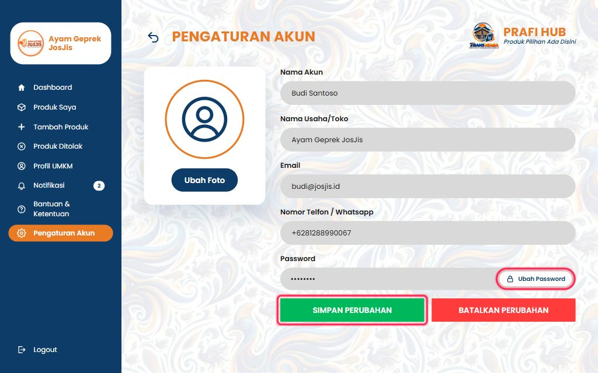

- **Lupa Password:** di halaman Login klik **Lupa Password**, masukkan email, lalu buka tautan di email (berlaku
  30 menit, sekali pakai). Setelah password diganti, semua sesi login lain berakhir.

  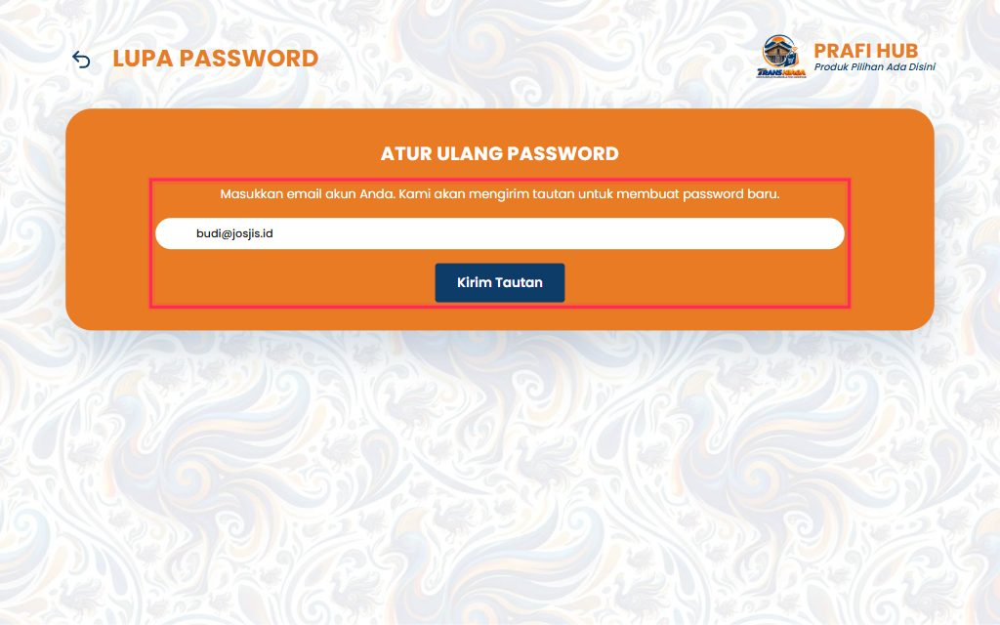

- Sesi login berakhir otomatis setelah **1 jam**; silakan login kembali.

---

## 4. Administrator

### 4.1 Mendaftar sebagai admin

1. Buka `/register/admin`, isi data, kirim, dan verifikasi email dengan OTP.
2. Tunggu akun **diaktifkan oleh Disnakertrans**. Sebelum itu login akan ditolak dengan pesan
   *akun belum diaktifkan*.

### 4.2 Menu admin

| Menu | Fungsi |
| --- | --- |
| Dashboard | Ringkasan: total UMKM, total produk, menunggu verifikasi, aktif, ditolak, dinonaktifkan (dapat disaring per rentang waktu), dan grafik **Statistik**: aktivitas per hari, status produk, produk per kategori, akun penjual (7 / 30 / 90 hari) |
| Konfirmasi Produk | Daftar produk yang menunggu keputusan. ✔ untuk menerima, ✖ untuk menolak dengan alasan, atau **Lihat Detail** |
| Manajemen Produk | Semua produk dengan tab status, pencarian, filter kategori, dan filter penjual |
| Kategori Produk | Tambah, ubah, dan hapus kategori produk beserta **gambarnya** (wajib; tampil di carousel Beranda, dapat diganti tetapi tidak dihapus). Kategori yang masih dipakai produk tidak bisa dihapus |
| Manajemen UMKM | *Akun Penjual*: aktifkan/nonaktifkan akun. *Profil Toko*: detail toko, WhatsApp, lokasi |
| Notifikasi | Produk baru diajukan, produk diperbarui, penjual baru, profil toko diperbarui |
| Pengaturan Administrator | Data akun, foto, dan password |

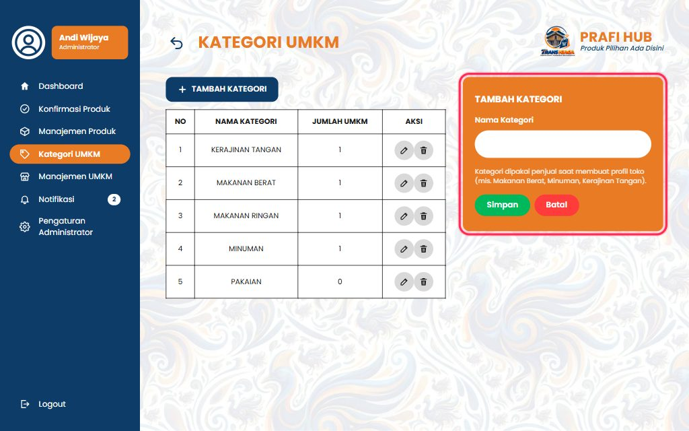

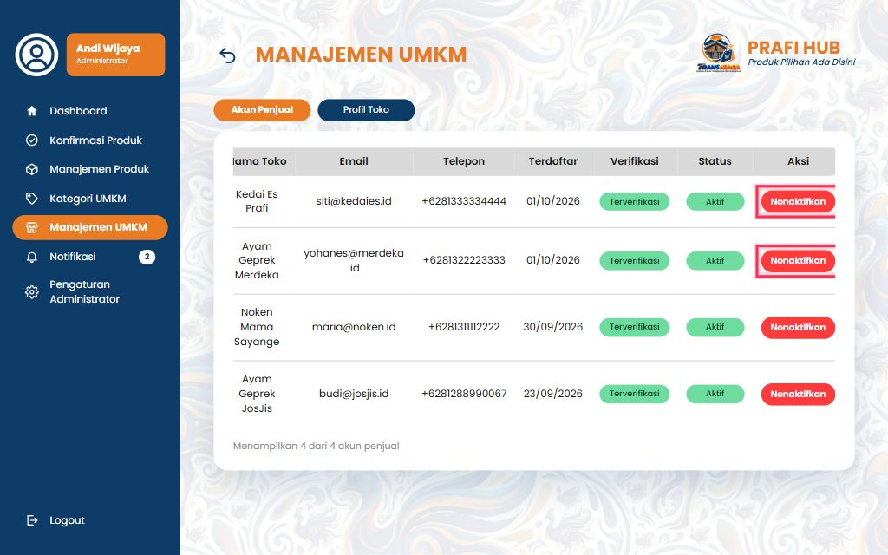

### 4.3 Memeriksa produk

1. Buka **Konfirmasi Produk** → **Lihat Detail**.

   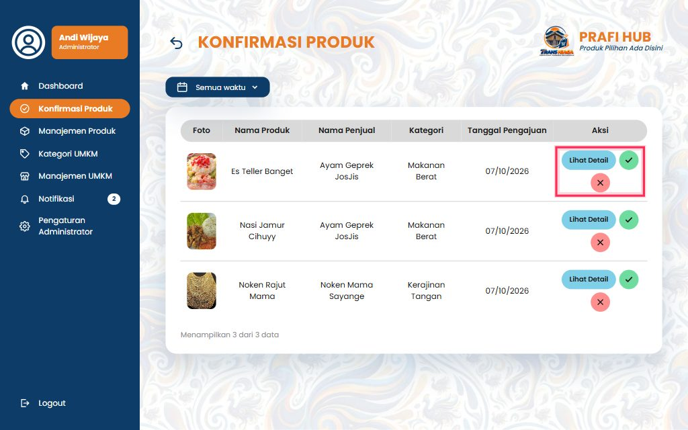

2. Periksa foto, nama, deskripsi, informasi produk, kategori produk, dan penjual.
3. Klik **TERIMA PRODUK** untuk menayangkan, atau isi **Alasan Penolakan** dan klik **TOLAK PRODUK**.

   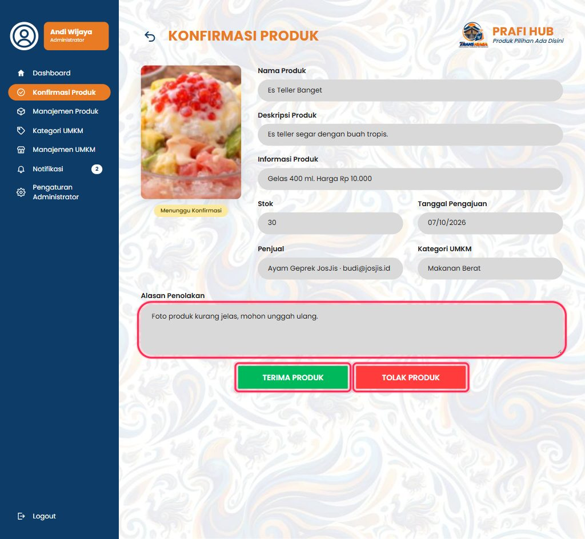

4. Produk aktif dapat diturunkan dengan **NONAKTIFKAN PRODUK** (alasan opsional).

> Menonaktifkan akun penjual langsung mengakhiri sesi login penjual tersebut.

---

## 5. Disnakertrans

Akun Disnakertrans dibuat oleh superadmin. Buka tautan aktivasi di email (berlaku 24 jam), lalu login dengan password
yang diberikan superadmin.

| Menu | Fungsi |
| --- | --- |
| Dashboard | Jumlah admin, admin belum aktif, UMKM, dan produk, serta grafik **Statistik** (aktivitas, status produk, produk per kategori, akun admin) |
| Aktivasi Admin | Aktifkan atau nonaktifkan akun admin (alasan opsional). Admin baru hanya bisa login setelah diaktifkan |
| Konfirmasi Produk | Menyetujui, menolak (dengan alasan), atau menonaktifkan produk — sama seperti admin |
| Data Produk / Data UMKM | Melihat semua produk dan profil toko; produk dibuka ke halaman konfirmasinya |
| Kategori Produk | Tambah, ubah, dan hapus kategori produk beserta gambarnya (wajib; carousel Beranda) — sama seperti admin |
| Notifikasi | *Admin Baru Menunggu Aktivasi*, serta notifikasi produk yang sama dengan admin (produk baru, diperbarui, ditayangkan) |

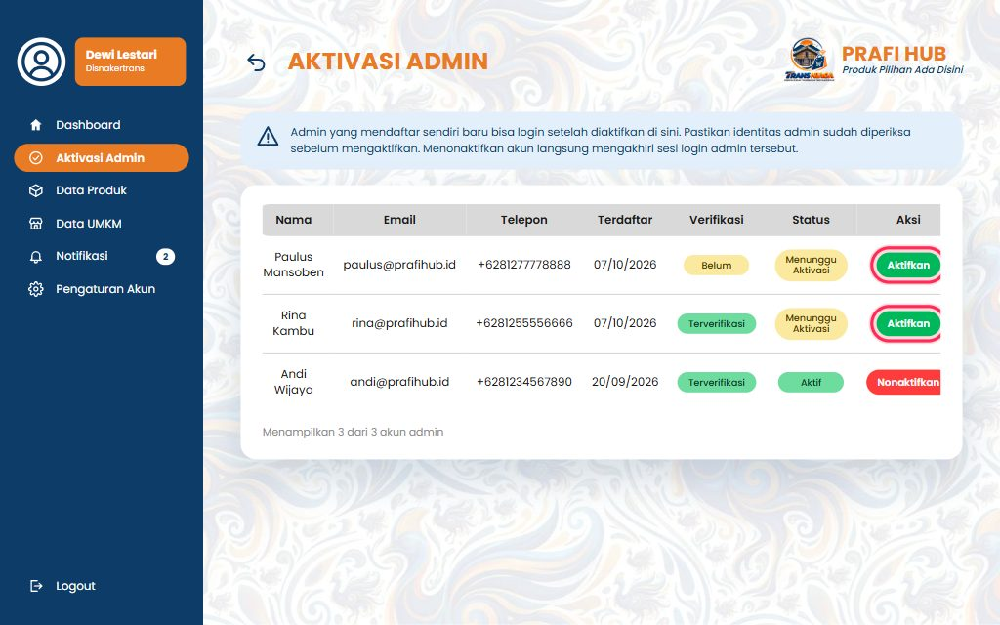

---

## 6. Superadmin

Akun superadmin dibuat oleh pengelola server. Superadmin **hanya membaca** data, kecuali membuat akun Disnakertrans.

| Menu | Fungsi |
| --- | --- |
| Dashboard | Ringkasan akun per role, produk, dan akun terbaru, serta grafik **Statistik** (aktivitas, status produk, produk per kategori, akun per role) |
| Akun Disnakertrans | **TAMBAH AKUN**: isi nama, telepon, email, dan password. Sistem mengirim tautan aktivasi ke email; berikan password secara langsung. Bila tautan kedaluwarsa, klik **Kirim Ulang Verifikasi** |
| Semua Pengguna | Semua akun, disaring per role |
| Data Produk / Data UMKM / Kategori Produk | Melihat data (hanya baca) |
| Log API | Catatan setiap penambahan, perubahan, dan penghapusan data **oleh pengguna yang login**, serta **semua aktivitas akun** (login, password/email salah, daftar, OTP, lupa/reset password, logout) termasuk dari tamu beserta **email yang dicoba**, baik yang berhasil maupun yang gagal. Permintaan baca dan permintaan tamu lainnya (ulasan, bot) tidak dicatat. Isi: siapa, kapan, field yang dikirim, dan ringkasan hasil atau error-nya. Filter **Hasil** (Berhasil / Gagal), method, status, path, email (pengguna atau email yang dicoba), dan tanggal. Log baru muncul otomatis (tanda **● Live**). **Grafik Log**: permintaan per hari (berhasil / gagal), per method, endpoint terbanyak, error terbanyak |
| Notifikasi | Akun baru, produk baru, serta akun yang dinonaktifkan dan produk tayang yang diturunkan |

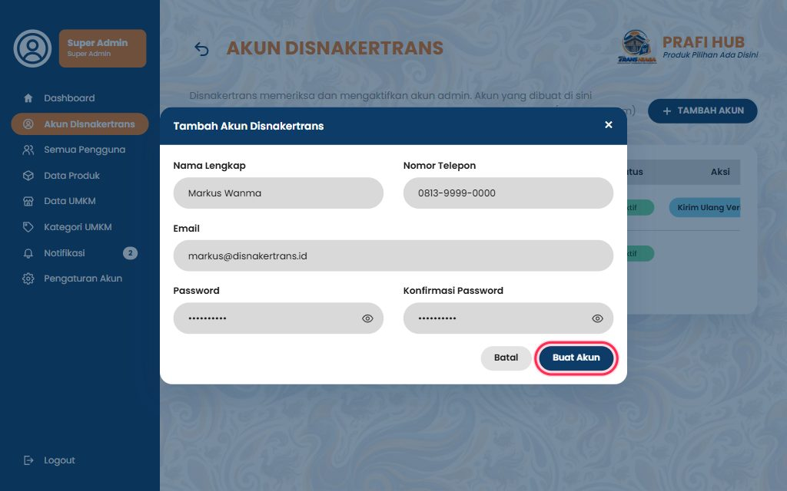

---

## 7. Bantuan

Butuh bantuan? Buka **Panduan → Hubungi Administrator** atau menu **Bantuan & Ketentuan** di dashboard penjual.
